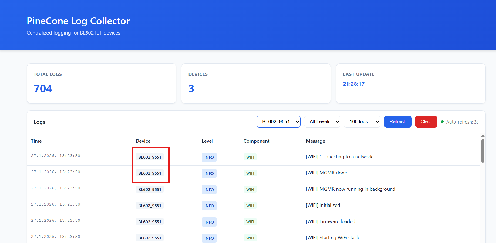
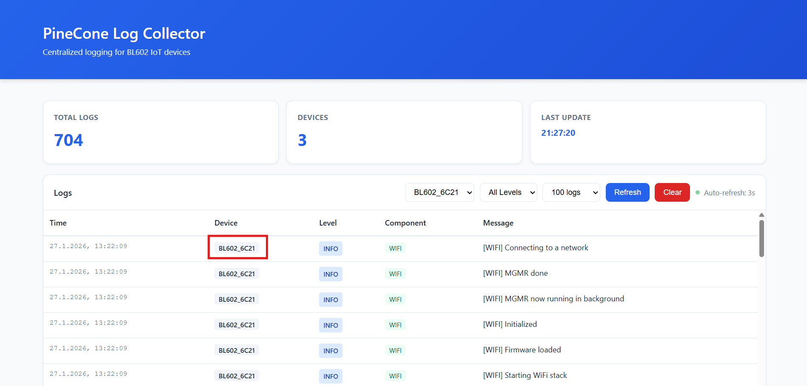
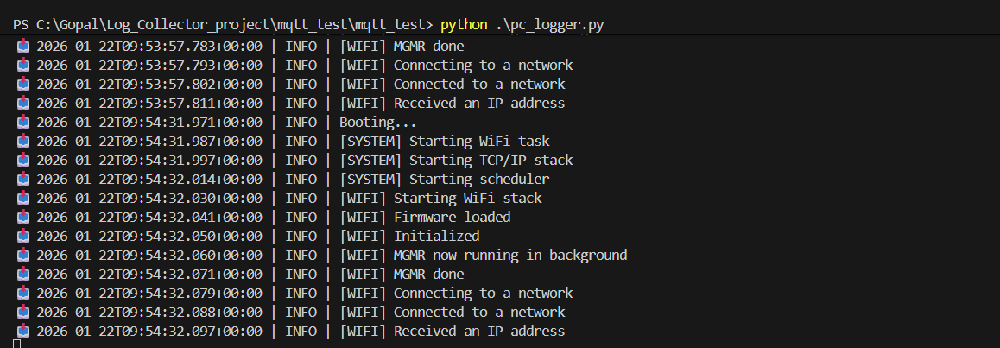
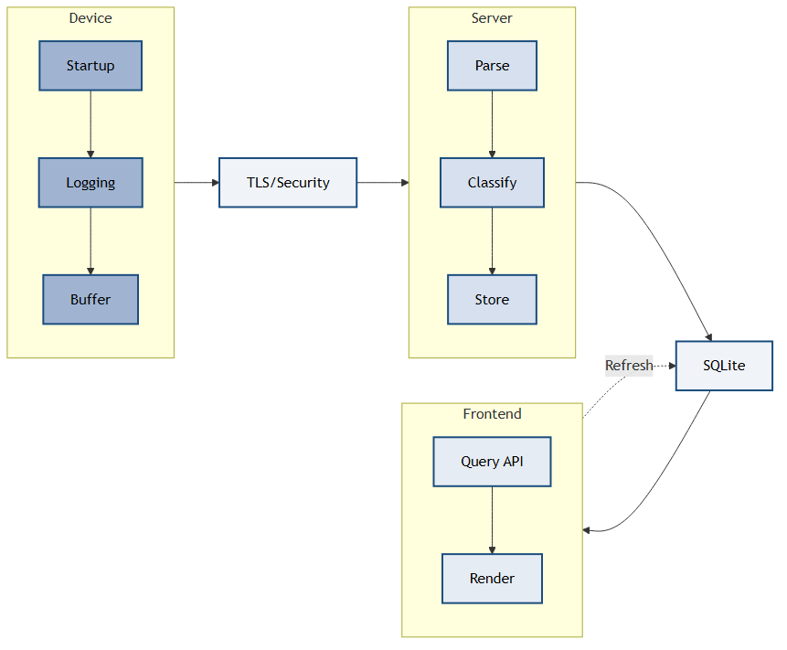
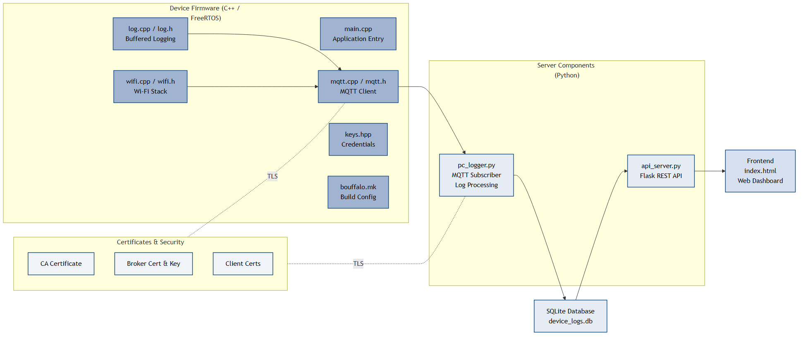

# 📡 BL602 Log Collector

A **real-time, multi-device logging and monitoring platform** for **PineCone BL602 IoT devices**, featuring MQTT aggregation, a REST API backend, persistent storage, and a modern web dashboard.

Monitor all your embedded devices from one place — live.


---

## 📋 Table of Contents

- [Features](#-features)
- [Screenshots](#-screenshots)
- [System Architecture](#-system-architecture)
- [Requirements](#-requirements)
- [Installation](#-installation)
- [Running the System](#-running-the-system)
- [Device Log Format](#-device-log-format)
- [API Endpoints](#-api-endpoints)
- [Project Structure](#-project-structure)
- [Dashboard](#-dashboard)
- [Database Schema](#-database-schema)
- [Troubleshooting](#-troubleshooting)
- [Development](#-development)
- [License](#-license)
- [Contributors](#-contributors)
- [Acknowledgments](#-acknowledgments)

---

## ✨ Features

- 🚀 Multi-device logging via MQTT wildcard (`logs/#`)
- 📡 Real-time log aggregation
- 📊 Interactive web dashboard
- 🧠 Automatic level classification (ERROR/WARN/INFO/DEBUG)
- 🗄️ Persistent SQLite storage with indexes
- 🔐 TLS-secured communication
- 🌐 REST API for programmatic access
- ⚡ Lightweight & easy to deploy

---

## 📸 Screenshots

### Dashboard – Device Specific Log Stream (BL602_9551)


---

### Dashboard – Device Specific Log Stream (BL602_6C21)


---

### Dashboard - Multiple Device Management


---

### Terminal


---

## 🏗 System Architecture

### Data Flow


**Flow**

1. Devices publish logs  
2. PC Logger processes and stores them  
3. API exposes filtered queries  
4. Dashboard visualizes logs in real time  

---

## 📦 Requirements

### PC / Server

- Python 3.8+
- pip
- Mosquitto MQTT broker

### Device

- BL602 SDK
- FreeRTOS
- C++17 toolchain

---

## 🔧 Installation

### 1. Clone

```bash
git clone https://github.com/SarthakBharad/bl602-log-collector.git
cd bl602-log-collector
```

### 2. Install dependencies

```bash
pip install -r requirements.txt
```

or

```bash
pip install flask flask-cors paho-mqtt
```

### 3. Start MQTT broker

```bash
mosquitto
```

---

## ▶ Running the System

### Start Collector

```bash
python pc_logger.py
```

### Start API + Dashboard

```bash
python api_server.py
```

Open:

```
http://localhost:5000
```

---

## 🧾 Device Log Format

### Topic

```
logs/<DEVICE_ID>
```

### Message

```
DEVICE_ID|TICK|[SUBSYSTEM] message
```

### Example

```
BL602_6C21|12345|[WIFI] Connected to network
BL602_A3F5|98765|[MQTT] Published sensor data
```

---

## 🔌 API Endpoints

### Get Logs
```
GET /api/logs
```

Filters:
```
?limit=100&device=ID&level=ERROR&component=WIFI
```

### Statistics
```
GET /api/stats
```

### Devices
```
GET /api/devices
```

### Health Check
```
GET /api/health
```

### Clear Logs
```
POST /api/clear
```

---

## 📁 Project Structure

### Repository Layout


```
bl602-log-collector/
├── api_server.py
├── pc_logger.py
├── static/
│   └── index.html
├── suas_app_mqtt/
│   ├── main.cpp
│   ├── wifi.cpp/h
│   ├── mqtt.cpp/h
│   ├── log.cpp/h
│   └── keys.hpp
├── certs/
├── ca_certificates/
├── device_logs.db
├── requirements.txt
└── README.md
```

---

## 🖥 Dashboard

### Capabilities

- Live log streaming
- Filter by device
- Filter by level
- Filter by subsystem
- Device online/offline status
- Expandable messages
- Severity color coding

### Levels

| Level | Meaning |
|--------|-----------|
| 🔴 ERROR | Failures |
| 🟡 WARN | Instability |
| 🟢 INFO | Normal |
| ⚪ DEBUG | Verbose |

---

## 🗄 Database Schema

```sql
CREATE TABLE logs (
    id INTEGER PRIMARY KEY AUTOINCREMENT,
    timestamp TEXT,
    device_id TEXT,
    device_tick INTEGER,
    level TEXT,
    subsystem TEXT,
    message TEXT
);
```

---

## 🛠 Building the Device Firmware

### Configure WiFi

Edit:

```
suas_app_mqtt/keys.hpp
```

```cpp
#define WIFI_SSID "SSID"
#define WIFI_PASSWORD "PASSWORD"
```

### Build

```bash
make -f bouffalo.mk
```

### Flash

```bash
bflb_iot_tool --firmware=firmware.bin
```

---

## 🧪 Troubleshooting

### Cannot connect to MQTT
- Ensure broker is running
- Verify TLS certificates
- Check port 8883

### No logs visible
- Ensure collector is running
- Verify topic format
- Check browser console

### Port already in use
```bash
lsof -i :5000
kill -9 <PID>
```

---

## ⚙ Development

### Ideas

- WebSocket streaming
- CSV/JSON export
- Log rotation
- Authentication
- Grafana integration
- Cloud deployment

### Production

```bash
gunicorn api_server:app
```

---

## 📜 License

MIT License — free for personal and commercial use.

---

## 🤝 Contributors

- **Sarthak Bharad** — Project Lead  
- **Gopal Awasthi** — Backend Development  
- **Deepak Rajadurai** — Editor  
- **Vishant Bimbra** — Backend Development  
- **Amit Pal Singh** — Frontend & Dashboard  

---

## 🙏 Acknowledgments

### Course & Mentorship

- **Prof. Ralf Colmar Staudemeyer, PhD** — Course Professor  
- **Tobias Tefke** — Course Tutor  

### Technologies

- PineCone BL602  
- Mosquitto MQTT  
- Flask  
- SQLite  
- FreeRTOS  

---

**Status:** ✅ Production Ready  
**Tested with:** Python 3.8+, Mosquitto 2.0+, BL602 SDK
