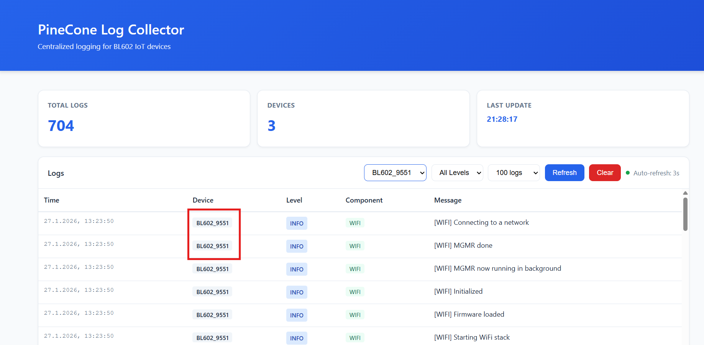
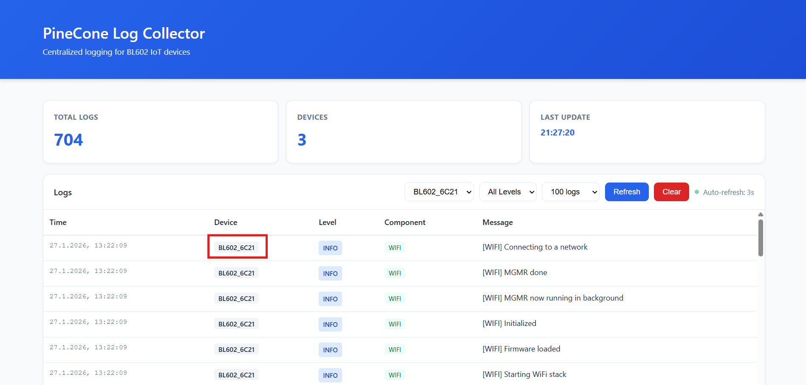
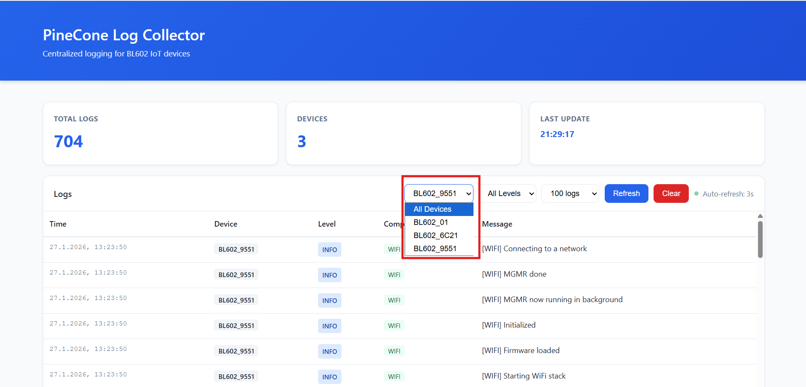
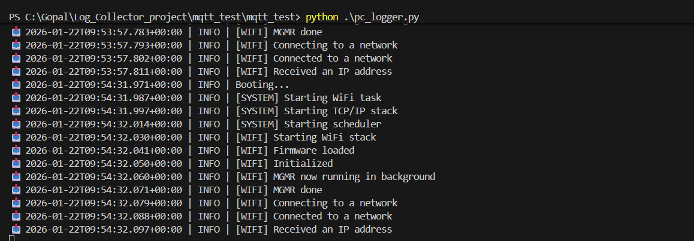
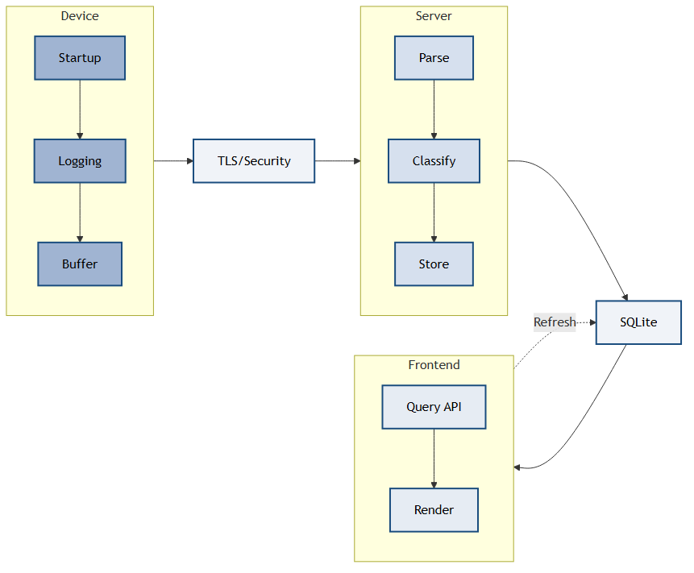
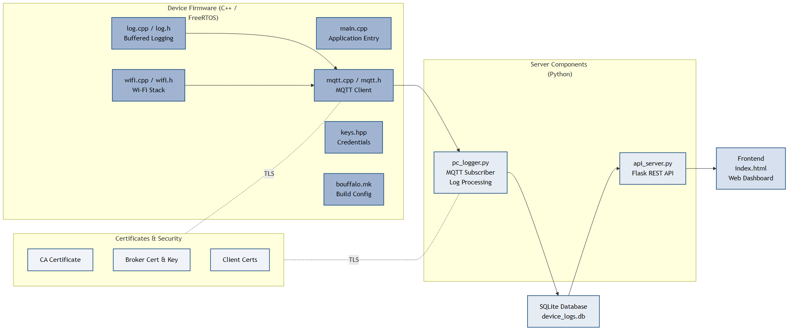

# BL602 Log Collector

A real-time, multi-device logging and monitoring platform for PineCone BL602 IoT devices. Logs are collected from multiple embedded devices over MQTT, stored centrally in SQLite, and made accessible through a REST API and web dashboard.


---

## Table of Contents

- [Overview](#overview)
- [Features](#features)
- [Screenshots](#screenshots)
- [System Architecture](#system-architecture)
- [Project Structure](#project-structure)
- [Requirements](#requirements)
- [Installation](#installation)
- [Running the System](#running-the-system)
- [Device Log Format](#device-log-format)
- [API Endpoints](#api-endpoints)
- [Database Schema](#database-schema)
- [Building the Device Firmware](#building-the-device-firmware)
- [Dashboard Capabilities](#dashboard-capabilities)
- [Troubleshooting](#troubleshooting)
- [Security Notes](#security-notes)
- [Future Improvements](#future-improvements)
- [License](#license)
- [Contributors](#contributors)
- [Acknowledgments](#acknowledgments)

---

## Overview

This project provides a complete end-to-end logging pipeline for BL602 devices:

**Device → Server → Database → API → Dashboard**

The system is split into four components:

**Device Firmware (C++ / FreeRTOS)** — Each BL602 device connects to WiFi, then opens a TLS-secured MQTT connection. Before the connection is established, logs are buffered in memory. Once MQTT is ready, buffered logs are flushed to the broker in batches and subsequent logs are sent as they come. Each device identifies itself using the last two bytes of its MAC address (e.g. `BL602_6C21`), and publishes to a dedicated topic: `logs/<DEVICE_ID>`.

**PC Logger (`pc_logger.py`)** — A Python script that subscribes to the `logs/#` wildcard topic, receiving messages from all devices at once. For each incoming message it assigns a server-side timestamp, classifies the log level (ERROR / WARN / INFO / DEBUG) based on message content, extracts the subsystem tag (e.g. `WIFI`, `MQTT`, `MEMORY`), and writes the result to a SQLite database.

**REST API (`api_server.py`)** — A Flask server that exposes the database contents over HTTP. Supports filtering by device, level, and limit. Also provides stats, device lists, and a clear endpoint.

**Web Dashboard (`index.html`)** — A browser-based interface that polls the API every 3 seconds and displays a live, filterable log table. Devices are discovered dynamically from incoming logs and added to a dropdown filter automatically.

---

## Features

- Multi-device support via MQTT wildcard subscription (`logs/#`)
- Automatic device identification from MAC address
- Pre-connection log buffering with batched flush on MQTT ready
- Server-side log level classification and subsystem extraction
- Persistent SQLite storage with indexed queries
- TLS-secured MQTT communication
- REST API for querying, filtering, and managing logs
- Auto-refreshing web dashboard with per-device filtering
- Timezone-aware timestamps (Europe/Berlin by default)

---

## Screenshots

### Dashboard – Device Specific Log Stream (BL602_9551)


---

### Dashboard – Device Specific Log Stream (BL602_6C21)


---

### Dashboard – Multiple Device Management


---

### Terminal – Collector Running


---

## System Architecture

### Data Flow



```
BL602 Devices
     |
     | MQTT TLS (logs/<DEVICE_ID>)
     v
pc_logger.py  -->  SQLite DB  <--  api_server.py
                                         |
                                         v
                                   Web Dashboard
```

1. Each BL602 device buffers logs locally until MQTT connects, then flushes them in batches.
2. `pc_logger.py` receives messages from all devices via wildcard subscription, classifies them, and stores them.
3. `api_server.py` reads from SQLite and serves filtered results over HTTP.
4. The web dashboard polls the API and renders the log table live.

---

## Project Structure



```
bl602-log-collector/
├── api_server.py            # Flask REST API
├── pc_logger.py             # MQTT collector and processor
├── static/
│   └── index.html           # Web dashboard
├── suas_app_mqtt/           # BL602 device firmware
│   ├── main.cpp
│   ├── wifi.cpp / wifi.h
│   ├── mqtt.cpp / mqtt.h
│   ├── log.cpp / log.h
│   └── keys.hpp
├── certs/                   # TLS client certificates
├── ca_certificates/         # CA certificate files
├── device_logs.db           # SQLite database (auto-created on first run)
├── requirements.txt
└── README.md
```

---

## Requirements

### Server / PC
- Python 3.8+
- pip
- Mosquitto MQTT broker

### Device
- BL602 SDK
- FreeRTOS
- C++17 toolchain

---

## Installation

Clone the repository:

```bash
git clone https://github.com/SarthakBharad/bl602-log-collector.git
cd bl602-log-collector
```

Install Python dependencies:

```bash
pip install -r requirements.txt
```

Start the MQTT broker:

```bash
mosquitto
```

---

## Running the System

Start the log collector in one terminal:

```bash
python pc_logger.py
```

Start the API server in a second terminal:

```bash
python api_server.py
```

Then open the dashboard at:

```
http://localhost:5000
```

---

## Device Log Format

Each device publishes to its own MQTT topic:

```
logs/<DEVICE_ID>
```

Where `DEVICE_ID` is derived from the device's MAC address at runtime — for example, a device with MAC ending in `6C:21` will use the topic `logs/BL602_6C21`. This requires no manual configuration.

Each line in the MQTT payload follows this format:

```
DEVICE_ID|TICK|[SUBSYSTEM] message
```

For example:

```
BL602_6C21|12345|[WIFI] Connected to network
```

Multiple log lines may be batched into a single MQTT message, separated by newlines. The collector splits and processes each line individually.

---

## API Endpoints

| Endpoint | Method | Description |
|---|---|---|
| `/api/logs` | GET | Retrieve logs with optional filters |
| `/api/stats` | GET | Total logs, total devices, online devices |
| `/api/devices` | GET | List of all devices with last-seen time and status |
| `/api/levels` | GET | Distinct log levels present in the database |
| `/api/components` | GET | Distinct subsystems extracted from log messages |
| `/api/clear` | POST | Delete all logs from the database |
| `/api/health` | GET | Health check |

The `/api/logs` endpoint accepts the following query parameters:

| Parameter | Default | Description |
|---|---|---|
| `limit` | 100 | Number of log entries to return |
| `device` | — | Filter by device ID (e.g. `BL602_6C21`) |
| `level` | — | Filter by log level (`DEBUG`, `INFO`, `WARN`, `ERROR`) |

Example:

```
/api/logs?limit=100&device=BL602_6C21&level=ERROR
```

---

## Database Schema

The database is created automatically on first run. The schema is:

```sql
CREATE TABLE logs (
    id           INTEGER PRIMARY KEY AUTOINCREMENT,
    timestamp    TEXT NOT NULL,
    device_id    TEXT NOT NULL,
    device_tick  INTEGER DEFAULT 0,
    level        TEXT NOT NULL,
    subsystem    TEXT NOT NULL DEFAULT 'SYSTEM',
    message      TEXT NOT NULL
);
```

Indexes are created on `device_id`, `level`, `subsystem`, and `timestamp` for fast filtering. The schema also supports automatic migration — if an older database is missing the `subsystem` or `device_tick` columns, they are added on startup.

---

## Building the Device Firmware

Configure your WiFi credentials and MQTT broker IP in the firmware source before building. The WiFi credentials are set in `wifi.h`:

```cpp
#define WIFI_SSID "your_ssid"
#define WIFI_PW   "your_password"
```

The MQTT broker IP is set directly in `mqtt.cpp`:

```cpp
IP_ADDR4(&mqttBrokerIp, 10, 25, 13, 186);
```

Then build the firmware:

```bash
make -f bouffalo.mk
```

And flash it to the device:

```bash
bflb_iot_tool --firmware=firmware.bin
```

---

## Dashboard Capabilities

- Live log stream, auto-refreshing every 3 seconds
- Filter logs by device, severity level, and result count
- Devices are discovered automatically from incoming logs and added to the filter dropdown without manual configuration
- Color-coded log levels (DEBUG, INFO, WARN, ERROR)
- Subsystem tags extracted from message prefixes (e.g. `[WIFI]`, `[MQTT]`, `[MEMORY]`)
- One-click log clearing with confirmation
- Displays total log count and total device count in a stats bar

---

## Troubleshooting

**Cannot connect to MQTT broker**  
Verify that Mosquitto is running, your TLS certificates are correctly placed, and that port 8883 is not blocked.

**No logs appearing in the dashboard**  
Check that `pc_logger.py` is running and connected. Verify the device is publishing to a topic matching `logs/#`. Check the browser console for any API errors.

**Port 5000 already in use**  
```bash
lsof -i :5000
kill -9 <PID>
```

---

## Security Notes

The default configuration uses `cert_reqs=ssl.CERT_NONE` for development convenience. For any production deployment you should:

- Generate your own CA and device certificates
- Enable full certificate validation
- Use strong, unique WiFi and MQTT credentials — avoid hardcoding them in source files
- Run the API server behind a reverse proxy
- Add authentication to the API if it is exposed on a network

---

## Future Improvements

- Log export to CSV and JSON
- API authentication
- Cloud deployment support

---

## License

MIT License

---

## Contributors

- **Sarthak Bharad** — Project Lead
- **Gopal Awasthi** — Backend Development
- **Vishant Bimbra** — Backend Development
- **Amit Pal Singh** — Frontend & Dashboard
- **Deepak Rajadurai** — Editor

---

## Acknowledgments

**Course & Mentorship**

- Prof. Ralf Colmar Staudemeyer, PhD — Course Professor
- Tobias Tefke — Course Tutor

**Technologies**

- PineCone BL602
- Mosquitto MQTT
- Flask
- SQLite
- FreeRTOS

---

Tested with Python 3.8+, Mosquitto 2.0+, and the BL602 SDK.